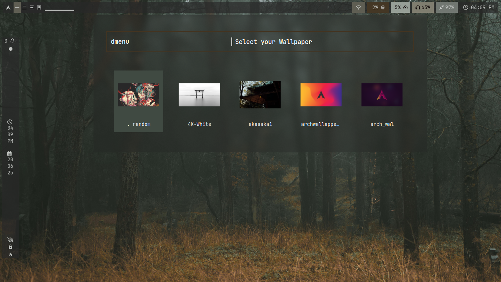
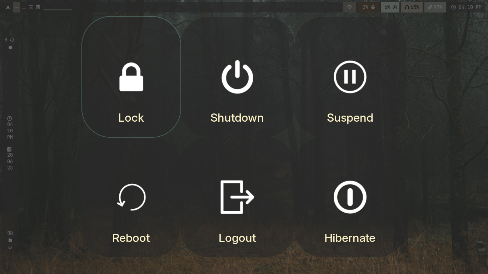

  _   _                     _       _       
 | | | |_   _ _ __  _ __ __| | ___ | |_ ___ 
 | |_| | | | | '_ \| '__/ _` |/ _ \| __/ __|
 |  _  | |_| | |_) | | | (_| | (_) | |_\__ \
 |_| |_|\__, | .__/|_|  \__,_|\___/ \__|___/
        |___/|_|                            
#     T E T S U O   -   D O T F I L E S                                        
                                                                                    
# hyprdots-tetsuo

**⚠️ Requiere instalar previamente la configuración base de [JaKooLit](https://github.com/JaKooLit/Arch-Hyprland)**

Configuración personalizada de **Hyprland** basada en los dotfiles de JaKooLit, adaptada por **Tetsuo** para **Arch Linux**.

🔧 **Enfocada en una experiencia productiva, minimalista y ligeramente retro**, con un diseño limpio, funcional y adaptable al flujo de trabajo diario.

> ⚠️ Este proyecto es altamente personal. No está pensado para ser una configuración genérica ni para otros usuarios, sino como un entorno de trabajo ajustado a mis gustos y necesidades.

---

## 📁 Estructura del repositorio

- `hypr/`  
  Configuración principal de Hyprland.

- `UserConfigs/`  
  Configuración modular separada por categorías: temas, reglas de ventana, animaciones, atajos de teclado, etc.

- `initial-boot.sh`  
  Script de arranque inicial para aplicar el fondo de pantalla y los colores del sistema.

- `.config/`  
  Archivos de configuración para las siguientes aplicaciones:
  - `cava`
  - `fastfetch`
  - `kitty`
  - `mpd`
  - `neofetch` *(opcional)*
  - `nvim`
  - `qutebrowser` *(opcional)*
  - `rmpc`
  - `rofi`
  - `swaync`
  - `wallust`
  - `waybar`
  - `wlogout`

- `.themes/`  
  Temas GTK utilizados: **Gruvbox**, **Catppuccin**, **Tokyonight**.

- `.icons/`  
  Paquetes de iconos utilizados.

---

## 📸 Screenshots

| Desktop | Desktop |
|----------------------|------------------------|
|  |  |

| Rofi Launcher | Rofi Launcher |
|---------------|----------------|
|  |  |

| Wlogout | Code (Neovim) |
|---------|-----------------------------|
|  |  |

---

## 🌈 Colores Automáticos Basados en el Wallpaper

Esta configuración está pensada para adaptar automáticamente los colores del sistema al fondo de pantalla actual usando `pywal` y `wallust`.

Los colores se aplican a:

- `waybar` (barra de estado)
- `rofi` (launcher)
- `kitty` (terminal)
- `neovim` (tema dinámico)
- `rmpc` (cliente de MPD)
- `swaync`, `wlogout`, entre otros

Todo esto ocurre al iniciar sesión o ejecutar el script `initial-boot.sh`, el cual detecta el wallpaper y actualiza los colores globalmente.

---

## ⚙️ Requisitos

Este setup depende de varias herramientas. Algunas vienen incluidas en la configuración base de JaKooLit, otras debes instalarlas manualmente:

### Incluidas con JaKooLit:
- `rofi`
- `swaync`
- `waybar`
- `wlogout`
- `kitty`
- `mpd`
- `wallust`

### Adicionales (debes instalarlas tú):
- `pywal`
- `mpc`
- `rmpc`
- `neovim`
- `qutebrowser`
- `neofetch`
---

### 🙏 Créditos

- [JaKooLit/hyprdots](https://github.com/JaKooLit/hyprdots)
- [rxyhn](https://github.com/rxyhn)
- [eylles/wallust](https://github.com/eylles/wallust)
- [dylanaraps/pywal](https://github.com/dylanaraps/pywal)

---

### ⚙️Paquetes escenciales
```bash
sudo pacman -S base-devel linux-headers git flatpak neofetch ntfs-3g
```
# 🔌 Instalar Vim-Plug para Neovim
```bash
sh -c 'curl -fLo "${XDG_DATA_HOME:-$HOME/.local/share}"/nvim/site/autoload/plug.vim --create-dirs \
       https://raw.githubusercontent.com/junegunn/vim-plug/master/plug.vim
```
### 🧰Utilidades básicas
```bash
sudo pacman -S htop vim wget curl
sudo pacman -S unrar p7zip zip unzip tar
sudo pacman -S noto-fonts noto-fonts-cjk noto-fonts-emoji ttf-dejavu
```
### 🧪Paquetes para mis dotfiles
```bash
sudo pacman -S pywal rmpc mpc neovim qutebrowser
yay -S neofetch
```
### 游뒆勇끆oleccion de wallpapers
(Aún no los subo)https://github.com/Tetsuo011/wallpapers-backup/tree/main/Wallpapers

